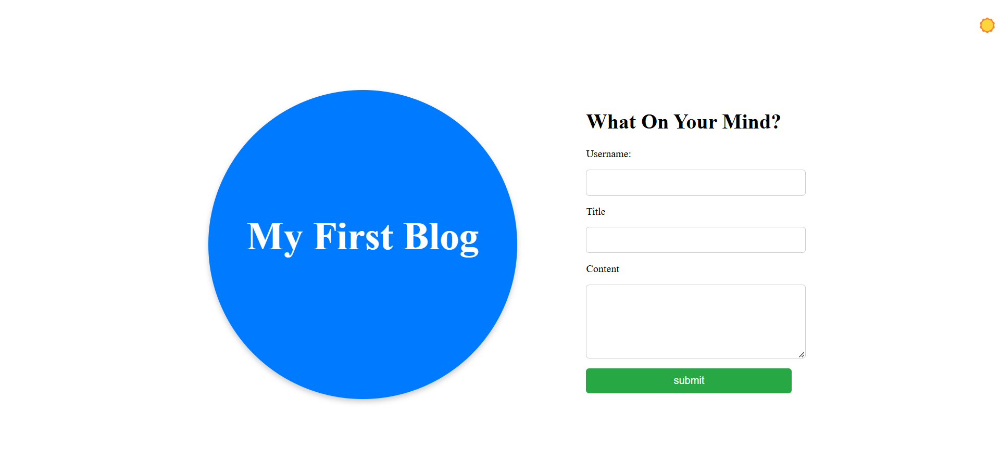
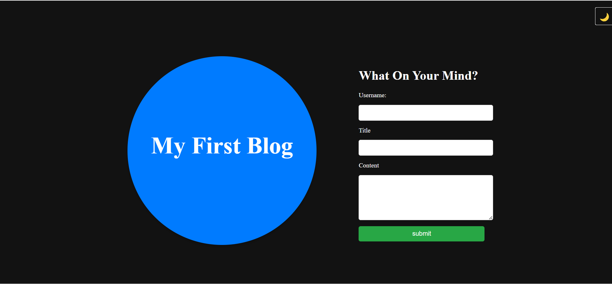
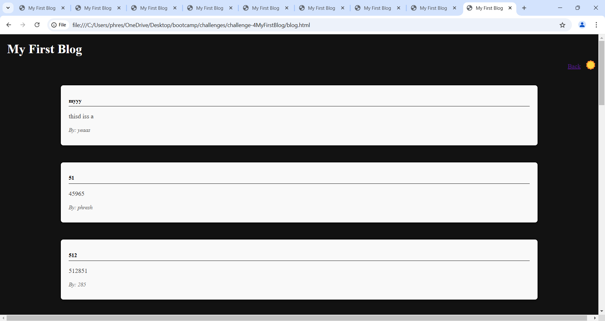

## First Blog Application

### Overview 
My First Blog is a simple web application that allows users to create and view blog posts. The application features a user-friendly interface, form validation, and the ability to toggle between light and dark themes. Blog posts are stored locally using localStorage, ensuring that data persists across sessions.

#### Features
Create Blog Posts: Users can submit blog posts by filling out a form with their username, title, and content.

View Blog Posts: All submitted posts are displayed on a dedicated blog page.

Theme Toggle: Users can switch between light and dark themes for better readability and personal preference.
Form Validation: Ensures that all required fields are filled out before submitting a post.

Responsive Design: The application is designed to be responsive and accessible on various devices.

Technologies Used
HTML: For structuring the web pages.

CSS: For styling the application, including custom themes and responsive design.

JavaScript: For handling form submissions, theme toggling, and dynamically rendering blog posts.

LocalStorage: For storing and retrieving blog posts locally.

### screenshots

### How to use 

# Clone the repository to your local machine.

# Submit a Blog Post:
Open index.html in your browser.

Fill out the form with your username, title, and content.

Click "Submit" to save the post.

# View Blog Posts:
After submitting a post, you will be redirected to blog.html, where all posts are displayed.

# Toggle Theme:
Click the theme toggle button (☀️/🌙) in the header to switch between light and dark themes.

Developed by Marquise as part of a bootcamp challenge.
Made with ❤️ and a passion for learning!